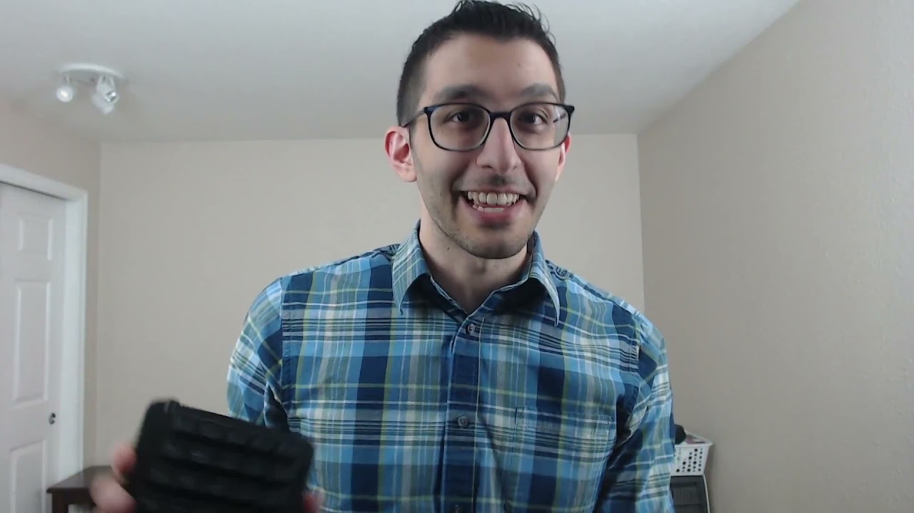
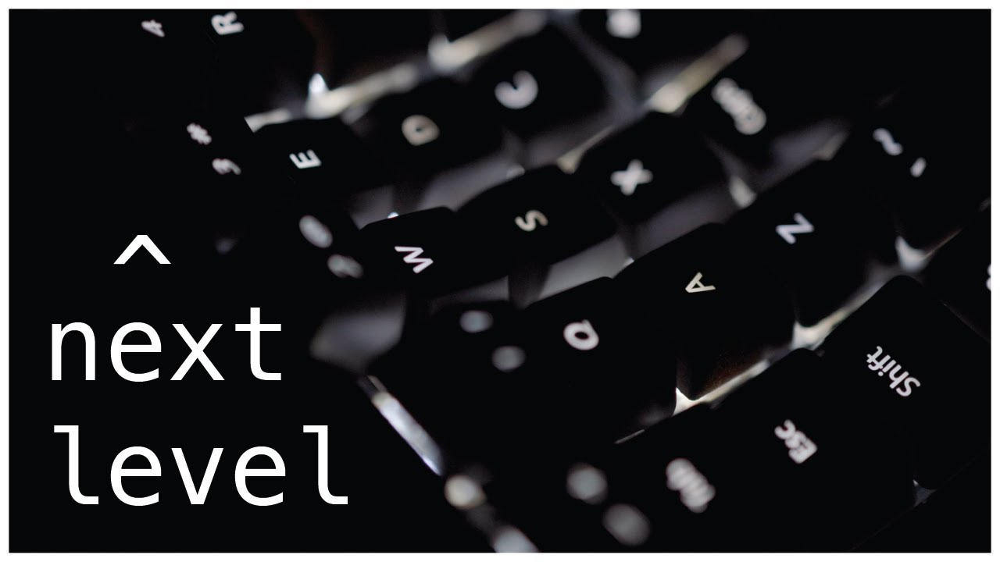

# The journey of going Insane:
My TKL keyboard from Cosmic Byte decided one day that it just wants to ....give up. 3 keys randomly stopped working completely. 
Naturally I figured I would open it and try to fix it - so I cracked it open and tried to bodge-wire it to the adjacent rows...
Then in the middle of all that i figured why not just change all of the switches to better ones?
Thats where things really started to spiral. (in the best way possible)

While looking through youtube finding videos for switch reviews i came across two videos from software developers that completely sealed my fate.

## The Game Changers.
| [My keyboard journey](https://www.youtube.com/watch?v=uilLCe1fvb0)  | [My keyboard journey](https://www.youtube.com/watch?v=pK41Mr4Kdd0) |
| -------------- | --------------- |
|  |  |

keys to a software developers dream
https://www.youtube.com/watch?v=pK41Mr4Kdd0

my keyboard journey
https://www.youtube.com/watch?v=uilLCe1fvb0

# List of keyboards i have Currently made.
 - [Lily 58](./Lily58.md) 
 - [Skorne](./Skorne.md)
 - Charybdis nano

# Upcoming.
 - [Totem](./Totem.md)
